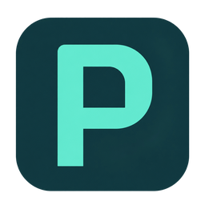
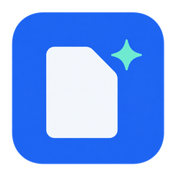
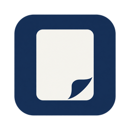

# PagePure 图标设计探索 · 2026-10-03

**最终决定：用户不采用这批候选 Logo，原生产 Logo、图标与品牌印章保留。** 本目录仅保存 2026-10-03 的历史设计附件，不是待上线资源。源码 0.7.7（未发布）的版本收尾不改变生产图标引用。

审核阶段曾建议选择 **A v2 青绿 P** 继续收敛。它把品牌首字母和干净页面的留白结合，轮廓大、对比强，16 像素下依然清楚。以下推荐与尺寸检查均为当时的设计观察，保留用于追溯。设计阶段仅独立保存三套设计稿，没有修改 manifest、HTML、CSS 或现有上线图标引用。

## 三套方案

| 方案 | 概念 | 推荐源图 | 适合的方向 |
| --- | --- | --- | --- |
| A v2 | 青绿与深墨，单个粗壮 P 和页面形状的内孔 | [A-teal-p-v2-source.png](A-teal-p-v2-source.png) | 品牌记忆与工具栏识别，推荐 |
| B | 保留蓝色，白色阅读页加一个小闪光 | [B-blue-pure-page-source.png](B-blue-pure-page-source.png) | 保留现有蓝色识别，同时减少旧图标细节 |
| C | 墨蓝底、柔和白页和宽阔翻折留白 | [C-ink-reading-page-source.png](C-ink-reading-page-source.png) | 更安静的阅读工具气质 |





## 小尺寸检查

已直接查看实际 16 × 16 和 32 × 32 PNG。

- A v2：16 像素可辨 P 与内孔；32 像素轮廓、负空间均清楚。
- B：16 像素页面清楚，闪光简化为小青绿点；32 像素可辨页面和四角闪光。
- C：16 像素保留页面轮廓，翻折弱化为角落的小缺口；32 像素翻折可辨。其品牌独特性弱于 A。

当时设计观察认为三者比旧图标的浏览器标题栏、正文线、中文盖章组合更容易缩小。A 的页面寓意较含蓄；B 的闪光容易让人联想到智能功能；C 可能与通用文档工具相似。以上保留为历史设计取舍，不改变用户保留原 Logo 的最终决定。

## 文件与导出

所有推荐源图均为 **1254 × 1254，RGBA PNG**。每套导出 16、32、48、128、256 像素 PNG，使用 Pillow `Image.Resampling.LANCZOS` 等比缩小，只做尺寸转换与 PNG 导出，没有手工绘制、合成、修补像素或重写 alpha。

- A v2：`A-teal-p-v2-{16,32,48,128,256}.png`
- B：`B-blue-pure-page-{16,32,48,128,256}.png`
- C：`C-ink-reading-page-{16,32,48,128,256}.png`

初版 A 出现容器内部低透明度斑块。已通过一次针对性的 built-in imagegen 编辑修复，A v2 是应审阅的版本。初版 `A-teal-p-source.png` 及其尺寸导出保留用于追溯，不应作为上线版本。

## 透明度与生产限制

四角像素均为 RGBA `[0, 0, 0, 0]`，外背景是真透明。A v2 的中心 20%–80% 区域最低 alpha 为 252；B、C 为 253。主体近乎不透明，修复后的 A 没有可见透明洞，但生成器没有严格落实“内部逐像素 alpha=255”的要求。原图还带有轻微亮度变化，因此它们是可选择的 AI 位图设计稿，尚不是严格两色、逐像素可控的矢量生产母版。

完整像素统计见 [image-validation.json](image-validation.json) 和 [A-teal-p-v2-validation.json](A-teal-p-v2-validation.json)。没有人工把这些限制隐藏或修补。

## 使用的工具模式

- 技能：`C:/Users/29485/.codex/skills/.system/imagegen/SKILL.md`
- 模式：**built-in imagegen**，没有使用 CLI、API key 或手绘 SVG 替代生成。
- 旧图标仅通过 `view_image` 查看以了解产品和复杂度；A、B、C 均为全新生成，不传入旧图标作为编辑目标。
- A、B、C：各一次生成调用，`transparent_background=true`，没有传 `referenced_image_paths` 或 `num_last_images_to_include`。
- A 修复：一次编辑调用，`transparent_background=true`，`referenced_image_paths` 为本目录的 `A-teal-p-source.png`。
- 生成器原文件保留在 `C:/Users/29485/.codex/generated_images/01a0ff35-8371-7b53-9e30-c56e6d188010/`；全部设计稿复制到当前目录。

## 实际提示词

以下按实际发送内容记录，没有将结果改写成更理想的提示词。

### A · 首次生成

```text
Use case: logo-brand
Asset type: square browser-extension app icon, PagePure web decluttering and focused reading assistant.
Primary request: Create one new, beautifully simple, confident brand icon. A bold geometric P monogram also evokes a clean page: one substantial vertical stem and a smoothly rounded upper bowl; the large inner counter reads as a clean page-shaped opening. The P is a single unified mark, not typography or a word. Let purposeful empty space convey keeping only the useful content.
Style/medium: impeccably crisp flat vector-like raster logo, no texture, no gradient.
Composition/framing: one centered icon only, a dark ink rounded-square container occupies about 88% of the square canvas, with generous balanced transparent margins. A large mint-teal P occupies the central 60% of the container. Large masses and wide negative space must still read clearly at 16px.
Color palette: very dark ink teal container (#11343B), vivid mint teal mark (#52E3CB), maximum two flat colors.
Scene/backdrop: genuinely transparent outside the rounded-square container.
Constraints: strong silhouette, optically balanced, no shadows, no separate decorative elements, no text, no Chinese characters, no words, no seal/stamp, no browser chrome, no magnifying glass, no shield, no mockup, no scene, no border, no watermark, no 3D. Only one logo.
```

### B · 首次生成

```text
Use case: logo-brand
Asset type: square browser-extension app icon, PagePure web decluttering and focused reading assistant.
Primary request: Create one new, clean, friendly, distinctive icon preserving a bright blue brand direction. The central symbol is a simple off-white page silhouette, with a compact four-point clean sparkle tucked beside its upper-right edge. The page is large and clearly separated from the small sparkle; exactly two main symbol shapes. The page needs no written lines or tiny fold details. Convey a webpage made clear and pleasant to read.
Style/medium: impeccably crisp flat vector-like raster logo, solid fills, no texture, no gradient.
Composition/framing: one centered icon only. A saturated blue rounded-square container occupies about 88% of the square canvas, with balanced transparent margins. Bold central page takes up about 58% of the container's height; sparkle remains substantial enough to read at 16px and does not overlap the page.
Color palette: blue container (#2468EB), warm off-white page (#F6FAFF), light turquoise sparkle (#72F2D6), maximum three flat colors.
Scene/backdrop: genuinely transparent outside the rounded-square container.
Constraints: large simple masses, broad negative space, memorable silhouette, no shadows, no document text lines, no text, no Chinese characters, no words, no seal/stamp, no browser chrome, no magnifying glass, no shield, no mockup, no scene, no border, no watermark, no 3D. Only one logo.
Alpha constraint: The whole blue rounded-square tile and both symbols are completely opaque, with alpha=255 and exact uniform flat fills. Only the exterior corners/margin are transparent. Absolutely no transparent holes, no patches, no lighting, no grain, no glow, no shaded surfaces.
```

### C · 首次生成

```text
Use case: logo-brand
Asset type: square browser-extension app icon, PagePure web decluttering and focused reading assistant.
Primary request: Create one new refined minimal reading icon. A single generous soft-white sheet of paper, slightly tall, has one broad softly curling lower-right corner that opens into empty space. Use a beautifully simple silhouette and a single clear negative-space fold, so it suggests calm reading and a page freed of clutter. The fold is a broad graphic shape, not a realistic curl. No written lines or extra symbols.
Style/medium: impeccably crisp flat vector-like raster logo, solid fills, no texture, no gradient, calm and editorial.
Composition/framing: one centered icon only. A dark navy rounded-square container occupies about 88% of the square canvas, with balanced transparent margins. The white page occupies about 62% of the container's height. The fold is deliberately broad and simple and remains identifiable at 16px.
Color palette: dark ink navy container (#162D50), soft warm white page (#F7F6F0), maximum two flat colors.
Scene/backdrop: genuinely transparent outside the rounded-square container.
Constraints: large simple masses, broad negative space, strong clean silhouette, no shadows, no narrow details, no document text lines, no text, no Chinese characters, no words, no seal/stamp, no sparkle, no browser chrome, no magnifying glass, no shield, no mockup, no scene, no border, no watermark, no 3D. Only one logo.
Alpha constraint: The whole navy rounded-square tile and white page are completely opaque, with alpha=255 and exact uniform flat fills. Only the exterior corners/margin are transparent. The fold is navy opaque negative space, not transparency. Absolutely no transparent holes, no patches, no lighting, no grain, no glow, no shaded surfaces.
```

### A · 透明斑块修复编辑

```text
Use case: precise-object-edit
Asset type: PagePure browser-extension icon; targeted correction of the supplied A teal P logo.
Input image: edit target, preserve the P monogram concept, proportions, position and rounded-square outline.
Primary request: Repair ONLY the flat fills and alpha of this logo. The dark ink rounded-square tile must be a single perfectly uniform, fully opaque solid-color shape. Fill every dark blotch/transparent hole inside the tile with the same opaque dark ink teal #11343B. The mint teal P must be one perfectly flat opaque #52E3CB mark. Remove all texture, shading and gradients. Preserve the exact bold geometric P and its large inner counter; the counter is solid dark ink teal, NOT a cutout to transparent background.
Transparency: ONLY the outside margin and rounded exterior corners are genuinely transparent. Every pixel strictly inside the rounded-square tile is 100% opaque (alpha 255), including both the empty area below the P bowl and its inner counter. No transparent patches, no almost-black holes, no erasing inside the tile. The dark tile is an actual colored object, not background to extract.
Constraints: preserve large-scale shape and layout; no new shapes, no text, no symbols, no border, no shadow, no glow, no texture, no lighting, no 3D. Deliver a crisp, clean two-color flat logo.
```
