# PagePure 0.7.6 · 实现与体验审核

**后续状态（2026-10-03）：** F01–F05 已完成本地修复及界面补齐，最终源码版本登记为 **0.7.7（未发布）**，见 [修复记录](PAGEPURE_FIXES_2026-10-03.md)。用户明确不采用候选 Logo，保留原生产 Logo；下文候选 Logo 建议、未实施的优化建议与缺陷复现均属于 0.7.6 修复前审核记录，行号对应当时基线，不表示已在 0.7.7 重新实测或实施全部建议。

主线设计可以保留：免费手动隐藏、明确保留优先、AI 可选且异步补充，这几个边界基本一致。当前最需要修正的是规则保存与清理的一致性，以及设置页的网站绑定。此次确认了 **5 个功能缺陷**；界面主流程可用，但作用范围、设置入口、保存反馈和品牌呈现需要收敛。

审核阶段的新 Logo 曾完成三个方案，当时推荐 **A · 青绿 P**。用户随后决定不采用，原生产图标保留。源图和 16/32/48/128/256px 导出保存在 `assets/brand/2026-10-03/`，仅作为历史设计附件，不是待替换的生产资产。

审核日期：2026-10-03。对象为本目录 PagePure 0.7.6，基线 HEAD `5b8cc3d5cb9d525eca596c19f4f51f95b5411f74`。审核阶段仅新增报告、截图、复现脚本和设计稿，当时未修改生产代码、版本号或发布台账；后续修复与版本收尾另见上述修复记录。

## 确认的功能缺陷

P1 表示应优先修正的数据目标或清理范围错误；P2 表示应修正的并发、生命周期或反馈错误。本次没有将主观视觉偏好列为功能缺陷。

| 编号 | 优先级 | 触发与实际行为 | 用户影响 | 核心位置 |
| --- | --- | --- | --- | --- |
| F01 | P1 | 为 A 网站打开设置页，来源标签导航到 B，再保存。表单仍标 A，后台把设置写给 B。 | 错改另一个网站的 AI 开关与需求。 | [popup.js:159](../extension/popup.js#L159)、[background.js:129](../extension/background.js#L129) |
| F02 | P1 | 点击“清除本页规则”，实际删除 site/type/page 三个范围，还删除对应撤销记录。 | 其他页面的共享规则一起消失，界面没有先说明这个影响。 | [popup.js:135](../extension/popup.js#L135)、[preview.js:465](../extension/preview.js#L465) |
| F03 | P2 | 正在编辑 A+C，另一标签新增 B。刷新把已保存组更新为 A+B，保存却把 A+B 当草稿基线。 | B 被误认为用户删除而丢失。 | [preview.js:108](../extension/preview.js#L108)、[preview.js:441](../extension/preview.js#L441)、[background.js:211](../extension/background.js#L211) |
| F04 | P2 | 选择模式初始化尚未结束时并发启动两次。`active` 只在异步等待前检查。 | 建立两套遮罩，取消只移除最后一套，网页仍被剩余选区层覆盖。 | [preview.js:339](../extension/preview.js#L339)、[preview.js:327](../extension/preview.js#L327) |
| F05 | P2 | 在新标签页等不可净化页面点击选择。后台返回 `ok:true, available:false`，前台当作成功。 | 提示“已进入选择模式”并关闭弹窗，实际没有进入。 | [background.js:265](../extension/background.js#L265)、[popup.js:113](../extension/popup.js#L113) |

### F01 · 设置绑定必须核对网站

设置页用 `tabId` 找来源标签；表单只在初始化时读取网站与需求，保存时却重新取来源标签当前 URL，没有预期 origin 校验。复现实测：界面显示 `alpha.test`，实际新增 `context:https://beta.test` 与 `ai:https://beta.test`。

建议保存请求携带读取表单时的预期 origin，后台在写入前核对。来源网站变化时拒绝写入，并提供“重新加载此网站设置”入口；保留用户草稿，避免静默切换写入对象。网站标识应常驻在设置页顶部。站点需求以 origin 为范围，同站普通页面导航不应被不必要地阻断。

### F02 · 清理范围与文案不一致

`keys()` 总是生成 site/type/page 三个 key。清除动作把它们全部送给 `rulesDelete`，后台同步移除规则、拆分边界与撤销记录。复现实测三个范围的规则与 undo 全部被删除。即使产品本意是“删除所有适用于本页的规则”，按钮仍没有说明会影响其他页面。

建议采用明确范围的清理对话框，分别列出“本页专属”和“跨页面共享”的规则及数量。若按钮改为“仅清理本页专属规则”，还要处理存放在共享组中的 `rule.page` 本页例外，不能只删除 page key。若需求是“仅让当前页恢复原样”，应使用已有原网页切换或本页保留例外，不能靠删除整站规则实现。管理器现有确认对话框可以复用其说明方式。

### F03 · 草稿基线不能随外部刷新改写

编辑开始时为 A，用户添加 C；另一标签保存 B 后，草稿仍为 A+C，但保存提交的 `baseRules` 已变成 A+B。后台差量合并因此把 B 视为删除：

```text
draftRules:      #reading, #third
transmittedBase: #reading, #promotion
storedRules:     #reading, #third
```

建议进入编辑时保存固定的基线，差量始终与该基线比较。外部刷新可以更新已保存规则与提示，但不能改变本轮编辑基线。不同规则的新增应保留；同一条规则的冲突需要明确处理策略。

### F04 · 初始化需要单次执行保护

两次 `start()` 可同时通过 `active` 检查，再分别等待语言与规则读取，随后各建立 host 和 layer。全局引用只指向最后一套。实测启动后 `hosts=2, layers=2`；取消后 `hosts=1, layers=1, active=false`。

建议增加 `starting` 状态或复用同一个初始化 Promise，用 `finally` 释放标记，并在异步等待后核对生命周期。退出时应能清除本轮建立的所有界面与事件。

### F05 · 不可用必须返回操作失败

当前 `pageAction` 的不可用结果含 `available:false`，但 `request()` 仅核对 `ok`。实测前台同时存在“请在普通网页使用”的错误状态和“已进入选择模式”的成功提示，且关闭弹窗一次。

建议页面操作返回明确失败，前台据页面能力禁用选择与切换，并显示可理解的原因。保留重试或打开普通网页的引导。

## 界面设计与实现

实际截图覆盖 11 个状态，可归为 6 个步骤。截图来自本轮运行的原始界面副本，配合隔离 mock 后端；不是已安装 Chrome 扩展的验收。

| 步骤 | 实际检查内容 | 状态与建议 | 截图 |
| --- | --- | --- | --- |
| 1 | 悬浮入口与操作台 | 可用；入口品牌与管理页不一致，面板固定高度留下较大空白。 | 01、02 |
| 2 | 进入选择、选区、更多菜单 | 可用；缺少明确的选择模式提示，默认跨页范围没有直观说明，“仅本页”藏在更多菜单。 | 03、04、05 |
| 3 | 隐藏草稿 | 可用；遮罩和“保存后生效”提示清楚，操作条遮住选中区域的一部分。 | 06 |
| 4 | 保存并应用 | 目标消失、其他内容补位；缺少扩展自身的成功反馈与可见撤销入口。 | 07 |
| 5 | 独立设置 | 功能字段可用；仍是 358px 弹窗布局，信息与保存规则需要收敛。 | 08 |
| 6 | 规则管理、清理确认、语言设置 | 列表与确认较完整；“设置”仅含语言，主标题仍叫“净化规则”。 | 09、10、11 |

### U01 · 统一设置入口和工作区

同一个“设置”按钮在悬浮操作台打开来源页设置，在工具栏弹窗中却打开规则管理器；后者的设置只有语言选择。`settings.html` 与 `popup.html` 重复界面结构，并共用 `popup.css` 的 358px 宽度。独立标签页因此留下大面积空白。

建议操作台入口明确叫“此网站设置”，规则入口叫“管理规则”。统一独立工作区，分为“当前网站”“已保存规则”“通用设置”，顶端显示网站。工具栏弹窗与网页操作台保留快速选择、显示模式和结果摘要；共享逻辑可以保留，页面布局按使用场景区分。

### U02 · 手动结果与 AI 状态分别显示

[popup.js:65](../extension/popup.js#L65) 优先显示 AI 关闭/无密钥原因，覆盖隐藏数量。截图 02、08 即使 mock 返回隐藏数量，也主要显示“此网站未启用 AI 判断”。这会削弱免费手动模式的完成感。

建议常驻显示“已隐藏 N 处”和“原网页 / 净化后”当前模式，AI 状态放在独立次级行。操作完成后给成功、失败或尚未保存的明确反馈。

### U03 · 保存时机统一或明确标出未保存

全局开关即时保存；AI 开关与需求等待“保存并应用”；“重新判断”使用已保存配置。用户刚勾选 AI 再点击重新判断，可能继续按旧配置执行。参见 [popup.js:74](../extension/popup.js#L74)、[popup.js:95](../extension/popup.js#L95)、[popup.js:109](../extension/popup.js#L109)。

建议开关采用一致时机。若保留表单提交，把它明确标为待保存；有草稿时“重新判断”应先保存，或清楚提示它使用已保存设置。全局开关应说明会影响所有网站。

### U04 · 隐藏范围成为一级选择

默认保存用 site 范围，但主操作条只写“此区域”。“仅本页”在更多菜单，用户未打开菜单时难以理解未来哪些页面会受影响。参见 [preview.js:390](../extension/preview.js#L390)、[preview.js:441](../extension/preview.js#L441)。

建议操作条直接显示范围选项与当前值，例如“仅当前页 / 此网站”，保存按钮邻近也能看见范围；区域描述使用内容标题，而非只写“已选区域”。此项先解决作用范围理解，再考虑外观润色。

### U05 · 提供可见撤销

后台每次保存会创建 undo 记录，也支持 `rulesUndo`；但产品界面没有触发 `undoSave` 的可见入口。截图 07 顶部蓝条中的“撤销上次保存”来自演示页面，不能当作扩展自身功能。

建议保存后显示短暂成功提示并提供“撤销”，在操作台保留恢复最近保存的入口。不要因为没有 UI 调用就立即删除已有恢复机制。管理器的批量清理目前明确告知无法撤销，这和保存撤销需分别说明。

### U06 · 设置视图保留路由与标题

[rules-manager.js:186](../extension/rules-manager.js#L186) 只切换 hidden，阻止链接导航；[rules-manager.js:209](../extension/rules-manager.js#L209) 修改语言后 reload。因此当前设置视图没有可恢复路由，刷新返回规则列表。截图 11 已直接确认设置内容与主标题不一致。

建议把视图保存在 hash 或 URL，加载时恢复，并随视图更新标题。语言更改后保留用户原来所在区域。

### U07 · 文字可读性与键盘风险

大量提示采用 11–12px；`#788398` 在 `#fbfcfe` 上的对比约 3.72:1，在白色上约 3.82:1。非禁用的普通说明文字应提高对比，普通文本 AA 的参考阈值为 4.5:1；Logo 与禁用控件有对应例外。依据：[W3C 对比度说明](https://www.w3.org/WAI/WCAG22/Understanding/contrast-minimum.html)。这是局部颜色检查，不是完整无障碍合规结论。

动态页选择模式还存在键盘风险：[preview.js:317](../extension/preview.js#L317) 重建全部选区按钮，焦点节点可能被删除；选区名字只读“区域 N”。建议保持节点身份或恢复焦点，给区域提供内容名称。此项需要真实浏览器测量焦点与读屏行为，本轮未宣称已复现完整键盘缺陷。

## 冗余与架构取舍

| 当前实现 | 判定 | 建议 |
| --- | --- | --- |
| 免费手动规则 + 可选异步 AI，明确保留优先 | 主线合理 | 保留。当前问题集中在保存、来源绑定和反馈。 |
| site/type/page key 与共享组中 `rule.page` 例外 | 有不同语义与历史兼容，不能只因两种表达就判冗余 | 先明确范围模型与 UI，再逐步收敛；清理时必须兼顾两种存放方式。 |
| `categories.js`、分类提示词和 `classifyCategory` | 退休机制残留，生产 manifest 不加载 categories，当前后台也不调用 classifyCategory | 盘点并删除无人调用的引擎及对应测试，保留当前 classifyBlock/splitBlock。 |
| `layout-snapshot.js`、后台 snapshotGet/Set、旧快照存储 | 当前内容脚本没有调用，后台仍暴露接口 | 移除未使用的引擎与接口；旧存储保留受控清理策略，不清理用户数据。 |
| 旧 category 规则过滤、CSDN 作者范围迁移 | 仍有兼容价值 | 保留，不能和退休分类引擎一起删。 |
| `startup.js` 全站 `document_start` 显示门禁 | 代码确定的体验取舍，无规则网页也先透明、禁点击，最多等待 1.5 秒 | 研究仅对已有规则页面启用门禁，并用真实 Chrome 测量闪烁与显示延迟。不是已实测每页白屏 1.5 秒。 |
| `startup.test.mjs` 仍用“应用 snapshot”命名 | 测试叙述已过期，实际只验证门禁回调 | 改成当前手动规则准备语义，避免高估快照覆盖。 |

退休引擎位置：[classifier.mjs:35](../extension/classifier.mjs#L35)、[classifier.mjs:115](../extension/classifier.mjs#L115)、[background.js:139](../extension/background.js#L139)。启动门禁位置：[startup.js:6](../extension/startup.js#L6)、[startup.js:15](../extension/startup.js#L15)。

## 新 Logo（未采用的历史方案）

旧图把浏览器窗口、正文线和中文印章放在一起；缩小后细节拥挤。工具栏、管理页采用位图，网页入口和标题又另用 CSS 印章，品牌也没有统一。

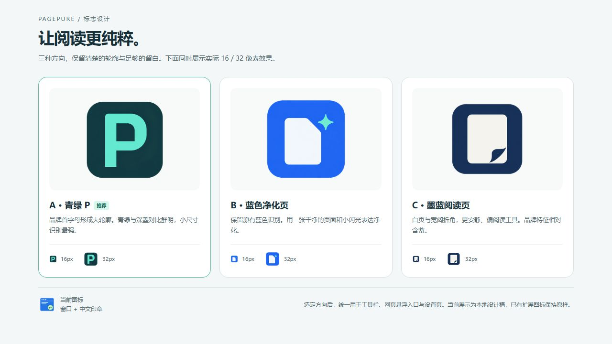

| 方案 | 设计与取舍 | 推荐源图 |
| --- | --- | --- |
| A · 青绿 P | 大轮廓、品牌首字母、强对比，16px 识别最好；页面寓意较含蓄。推荐。 | [A 源图](../assets/brand/2026-10-03/A-teal-p-v2-source.png) |
| B · 蓝色净化页 | 保留蓝色识别，干净页面 + 闪光更直观；容易让人联想到 AI。 | [B 源图](../assets/brand/2026-10-03/B-blue-pure-page-source.png) |
| C · 墨蓝阅读页 | 更安静、偏阅读工具；品牌独特性弱一些。 | [C 源图](../assets/brand/2026-10-03/C-ink-reading-page-source.png) |

三个方向均使用 built-in imagegen 生成；A 初版的透明斑块已通过一次定向编辑修复，使用 A v2。源图为 1254×1254 RGBA，并按实际尺寸导出 16/32/48/128/256px；已查看 16/32px。提示词、透明度检查与源文件说明见 [品牌设计说明](../assets/brand/2026-10-03/README.md)。它们是可审阅的位图设计稿。

审核时曾建议：选定方向后，统一用于 manifest 工具栏图标、网页入口、popup/settings 标题与管理器品牌；隐藏遮罩中的状态文字独立表达“已隐藏”。该品牌替换建议未获用户采用，后续保留原 Logo、图标和品牌印章，此处仅保留历史设计思路。

## 修复与验证顺序

1. 先修 F01/F02/F03：固定写入网站、明确清理范围、固定草稿基线。这一批保护规则与设置的正确性。
2. 再修 F04/F05：单次初始化及页面能力判断，避免遮罩残留和错误成功反馈。
3. 收敛设置入口、可见作用范围、手动结果、保存/撤销反馈与路由状态，再统一品牌资产。
4. 最后删退役引擎、整理过期测试名，并有针对性地测量启动体验。

现有 `npm test` 本轮 **219/219 通过**。另外两份独立复现脚本连接真实源文件与内存 Chrome stub，均执行成功，证明 F01–F05 仍存在；它们是缺陷证据，不是修复验收通过。

```powershell
node 'E:\AII-Jev\zhihu\output\ui-audit-2026-10-03\core-reproductions.mjs'
node 'E:\AII-Jev\zhihu\output\ui-audit-2026-10-03\ui-reproductions.mjs'
```

历史本地证据：[核心复现](E:/AII-Jev/zhihu/output/ui-audit-2026-10-03/core-reproductions.mjs)、[核心结果](E:/AII-Jev/zhihu/output/ui-audit-2026-10-03/core-evidence.json)、[界面复现](E:/AII-Jev/zhihu/output/ui-audit-2026-10-03/ui-reproductions.mjs)、[界面结果](E:/AII-Jev/zhihu/output/ui-audit-2026-10-03/ui-evidence.json)。`output/` 被 Git 忽略，以上绝对路径仅供原工作区复查，不随 Git 分发，也不能作为修复后验收。报告、未采用的 Logo 附件与下方截图位于仓库目录，可随本次收尾提交；审核时它们尚未提交。

修复后应把上述五种场景转为回归断言，再做一次真实 Chrome：两个来源标签并发编辑；设置页打开后来源跨站；混合本页/整站规则清理；快速重复进入选择并退出；在不可净化页面打开弹窗。真实 AI 调用、读屏、商店安装和启动延迟未在本轮验证。

## 本轮截图

以下均为本轮实际捕获、原样保存并重新打开检查过的 JPEG。演示栏属于样本网页，不属于扩展。设置页与规则管理器使用原始 HTML/CSS/JS 副本，后台模拟，展示网站与规则是样本数据。

### 1 · 入口与操作台：可用，品牌与反馈需要统一

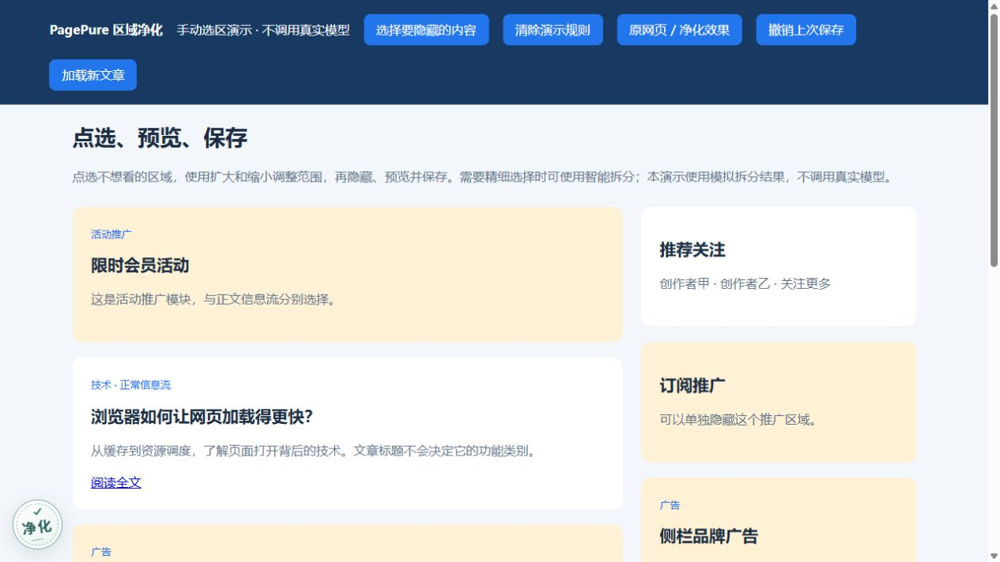
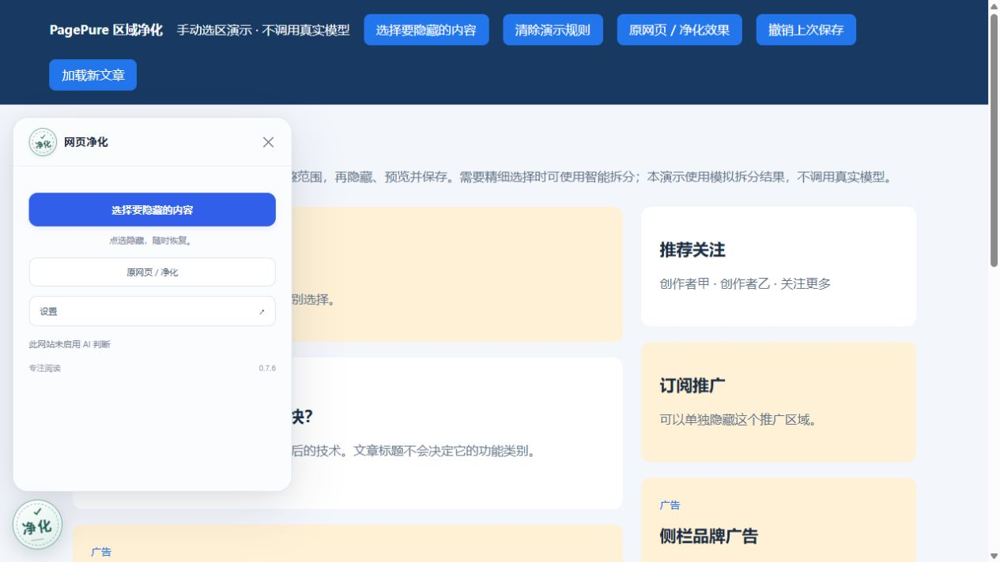

### 2 · 选择与范围：可用，默认作用范围不明确

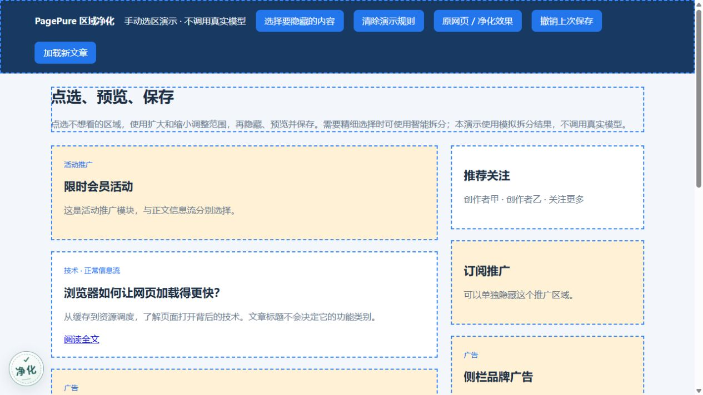
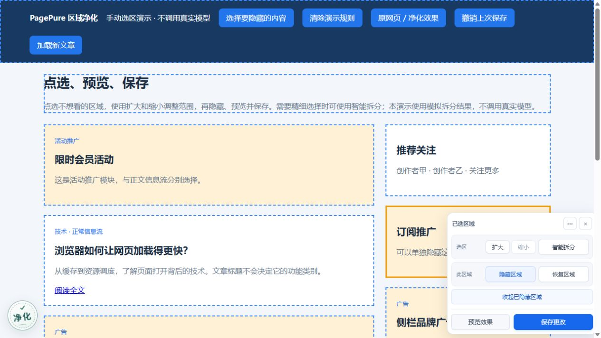
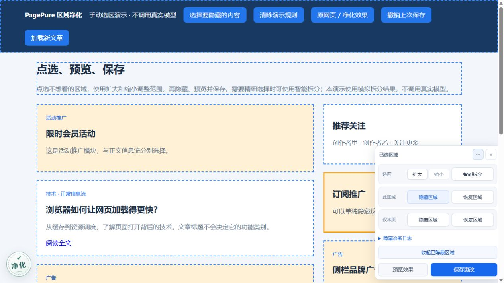

### 3 · 隐藏草稿：可用，提示保存后生效

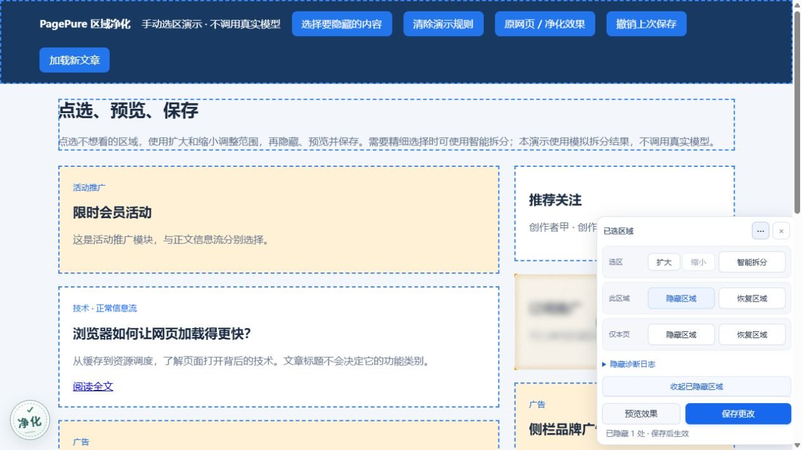

### 4 · 保存应用：效果成立，缺少扩展自己的撤销入口

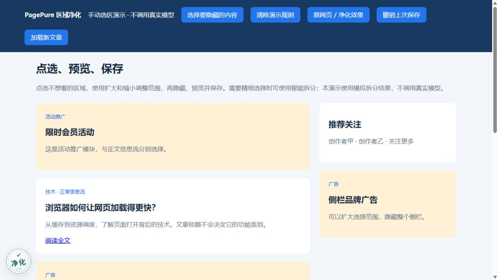

### 5 · 独立设置：字段可用，布局和网站绑定需改进

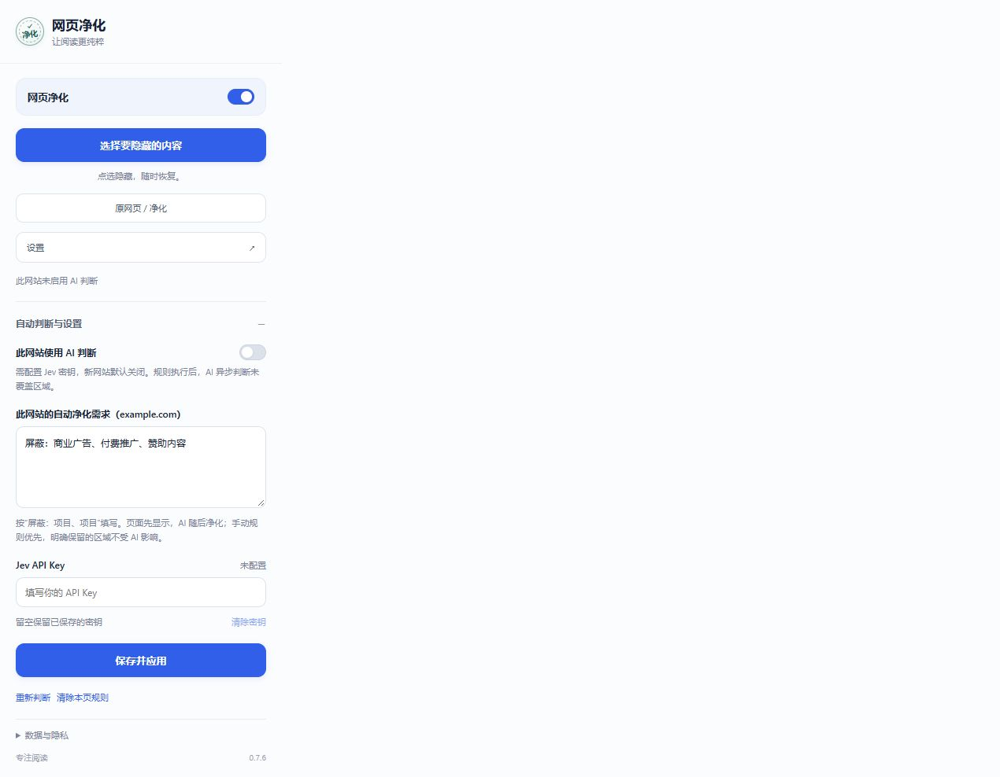

### 6 · 管理器：清理确认较清楚，设置标题存在矛盾

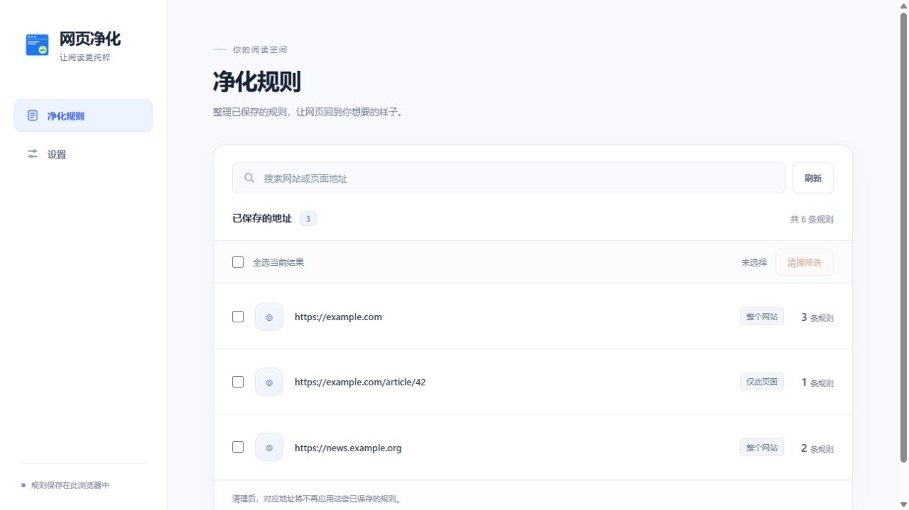
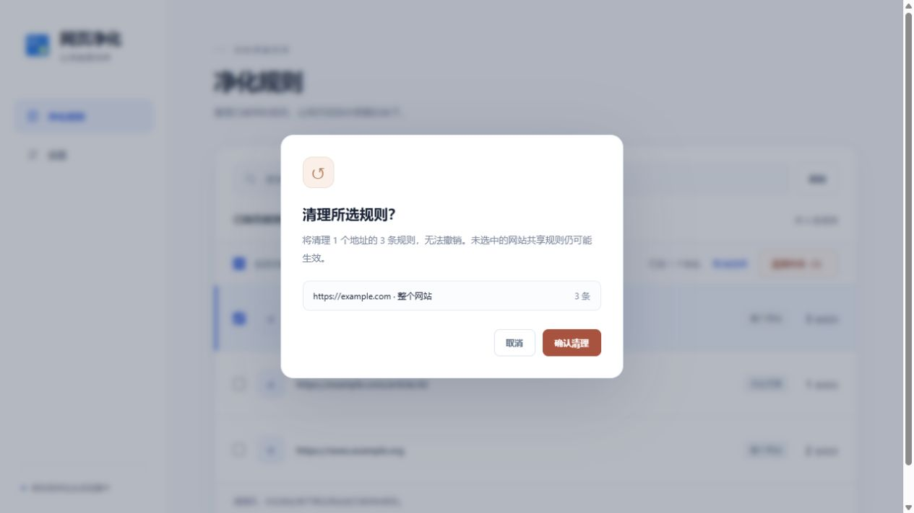
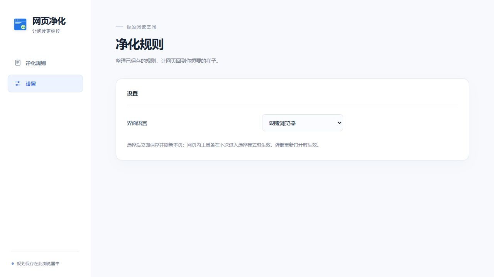
